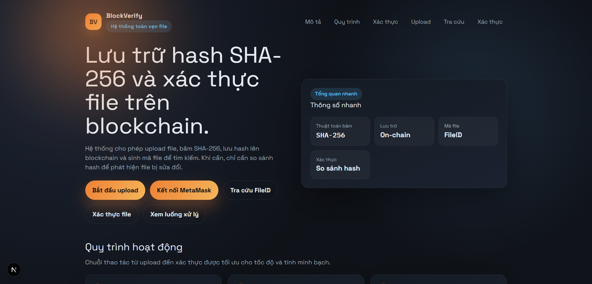
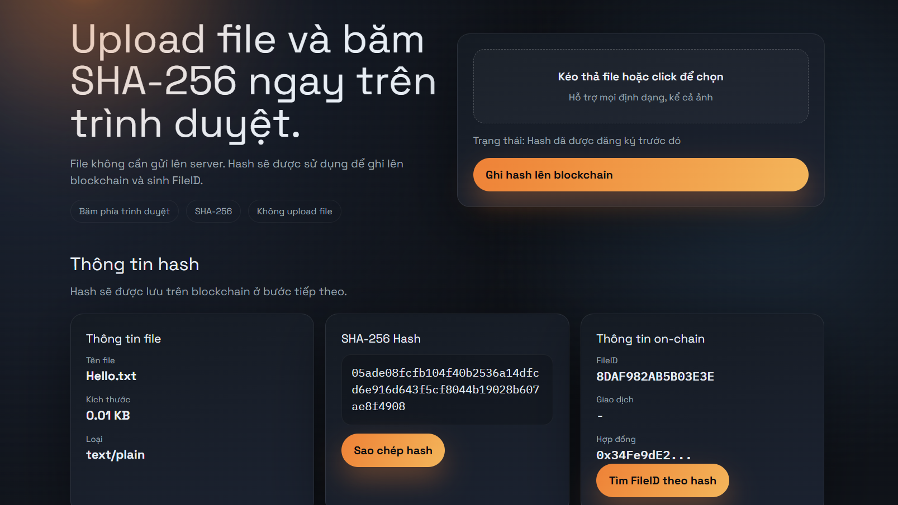
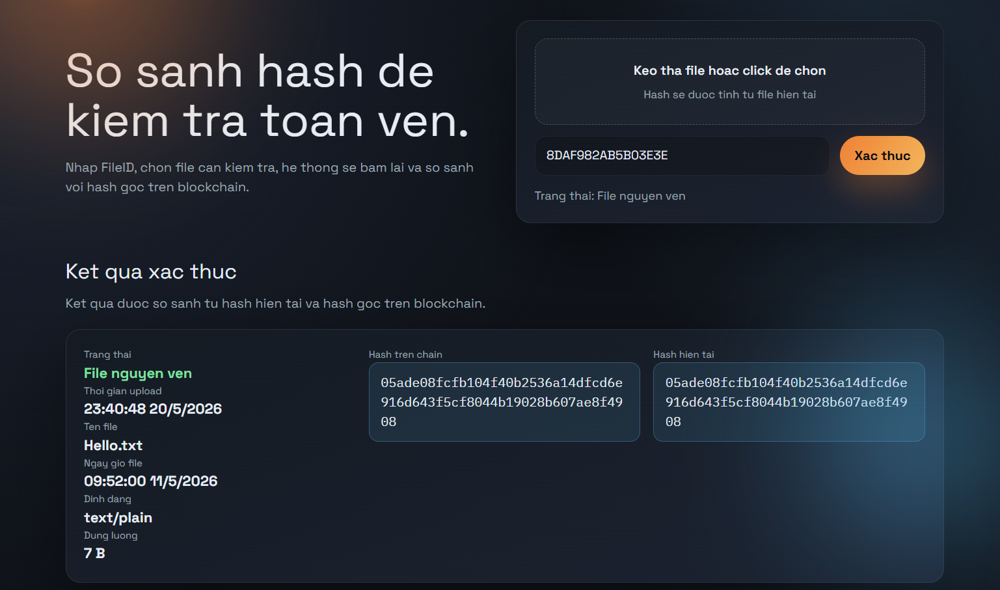

<h2 align="center">
    <a href="https://dainam.edu.vn/vi/khoa-cong-nghe-thong-tin">
    🎓 Faculty of Information Technology (DaiNam University)
    </a>
</h2>
<h2 align="center">
   HỆ THỐNG LƯU TRỮ VÀ XÁC THỰC FILE BẰNG BLOCKCHAIN
</h2>
<div align="center">
    <p align="center">
        
        
        
    </p>

[](https://www.facebook.com/DNUAIoTLab)
[](https://dainam.edu.vn/vi/khoa-cong-nghe-thong-tin)
[](https://dainam.edu.vn)

</div>

---

## 1. Giới thiệu
**BlockVerify** là một hệ thống ứng dụng phi tập trung (DApp) giúp đảm bảo sự toàn vẹn và xác thực của file dữ liệu. Bằng cách băm (hash) file bằng thuật toán SHA-256 trực tiếp trên trình duyệt và lưu chuỗi hash lên mạng lưới blockchain, hệ thống chống lại việc giả mạo hay chỉnh sửa trái phép nội dung.

Dự án này được phát triển bằng **Next.js/React** cho giao diện người dùng và **Solidity** cho Smart Contract, sử dụng **MetaMask** để giao tiếp với mạng blockchain. Hệ thống gồm:

- **Smart Contract (FileRegistry)**:  
  - Lưu trữ mã băm SHA-256 của các file.  
  - Cấp phát và quản lý FileID duy nhất cho mỗi file được tải lên.  
  - Lưu lại thông tin người tạo (address), thời gian (timestamp) và thông tin cơ bản của file.  

- **Frontend (Web App)**:  
  - Giao diện thân thiện sử dụng **React / Next.js**.  
  - Thực hiện băm (hash) file trực tiếp trên trình duyệt (client-side) để bảo vệ quyền riêng tư, không cần upload nội dung file lên server.  
  - Cho phép người dùng đăng ký file lưu trên blockchain, tra cứu thông tin và xác thực file so với bản gốc.

Hệ thống mang đến giải pháp minh bạch, được ứng dụng trong việc công chứng tài liệu, bảo vệ bản quyền, và xác thực văn bằng chứng chỉ.

### 1.1. Các tính năng chính

### Upload và Đăng ký File
Người dùng có thể chọn một file. Trình duyệt tự động băm file và yêu cầu người dùng sử dụng ví MetaMask ký và gửi giao dịch để lưu chuỗi hash đó lên Smart Contract cùng metadata (tên file, kích thước).

### Mã định danh duy nhất (FileID)
Sau khi giao dịch thành công, mỗi bản ghi sẽ được hệ thống cấp một **FileID** duy nhất liên kết với mã băm đó và người đăng tải.

### Tra cứu thông tin
Sử dụng FileID, bất kỳ ai cũng có thể tra cứu xem file được lưu trữ bởi địa chỉ ví nào, vào khoảng thời gian nào mà không cần sở hữu file gốc.

### Xác thực toàn vẹn (Verify)
Để kiểm tra một file (ví dụ hợp đồng hay văn bằng) có bị sửa đổi hay không, người dùng tải file đó lên giao diện Xác thực. Hệ thống sẽ băm file và đối chiếu với hash gốc đang được lưu trữ trên blockchain để đưa ra kết quả khớp (toàn vẹn) hay không khớp (bị chỉnh sửa). 

### 1.2. Minh họa luồng hoạt động

[ File đích ] --> (Trình duyệt SHA-256) --> [ Hash ] --> (MetaMask ký) --> [ Smart Contract ]
                                                                                |
[ File đối chứng ] --> (Trình duyệt SHA-256) --> [ Hash ] <--(Đối chiếu)--------+


## 2. Các công nghệ được sử dụng
<div align="center">

[](https://nextjs.org/) [](https://reactjs.org/) [](https://soliditylang.org/) [](https://docs.ethers.org/) [](https://metamask.io/) [](https://tailwindcss.com/)

</div>

---

## 3. Một số hình ảnh hệ thống

<div align="center">
  
  <p><b>Giao diện Trang chủ (Tổng quan)</b></p>
</div>

<br>

<div align="center">
  
  <p><b>Giao diện Tính năng Upload</b></p>
</div>

<br>

<div align="center">
  
  <p><b>Tra cứu thông tin FileID và Đối chiếu hash</b></p>
</div>

<br>

---

## 4. Các bước cài đặt

### 4.1. Yêu cầu
- Node.js (phiên bản 18+ khuyến nghị)
- Tiện ích mở rộng ví **MetaMask** trên trình duyệt
- Trình soạn thảo (Visual Studio Code đề xuất)

### 4.2. Clone project
```bash
git clone [https://github.com/Quan0804/btl.git](https://github.com/Quan0804/blockverify-file-integrity.git)
```

### 4.3. Cài đặt các thư viện (Dependencies)
Mở terminal tại thư mục của dự án và chạy:
```bash
npm install
```

### 4.4. Cấu hình Smart Contract (nếu tự deploy)
- Đảm bảo bạn đã kết nối vào đúng mạng (ví dụ Sepolia/Localhost) trên MetaMask.
- Nếu tự compile và deploy contract, hãy cập nhật lại địa chỉ Contract cùng ABI vào file `app/contract.json`.

### 4.5. Khởi chạy Ứng dụng Frontend
Khởi động máy chủ Next.js (Web App):
```bash
npm run dev
```

### 4.6. Trải nghiệm
- Mở trình duyệt và truy cập: `http://localhost:3000`
- Kết nối ví MetaMask (đảm bảo chọn đúng mạng đã deploy Contact).
- Sử dụng các tính năng Upload, Tra cứu, Xác thực.

---

## 5. Liên hệ với tôi
📧 Email: vuquan0804@gmail.com
📞 Phone: 0364973088
🌐 Facebook: [Your Profile](https://www.facebook.com/vuquan.844/)
